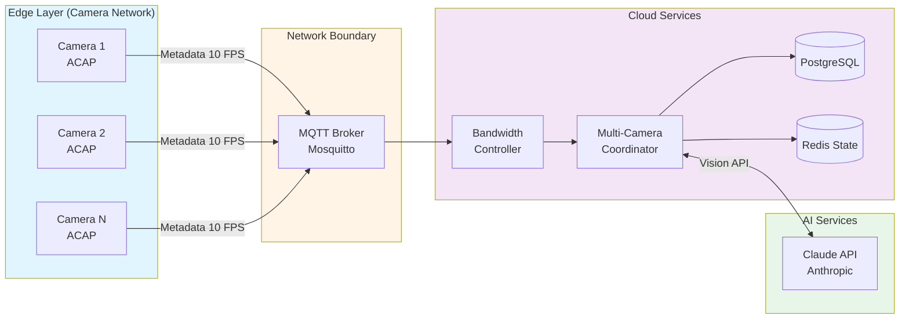
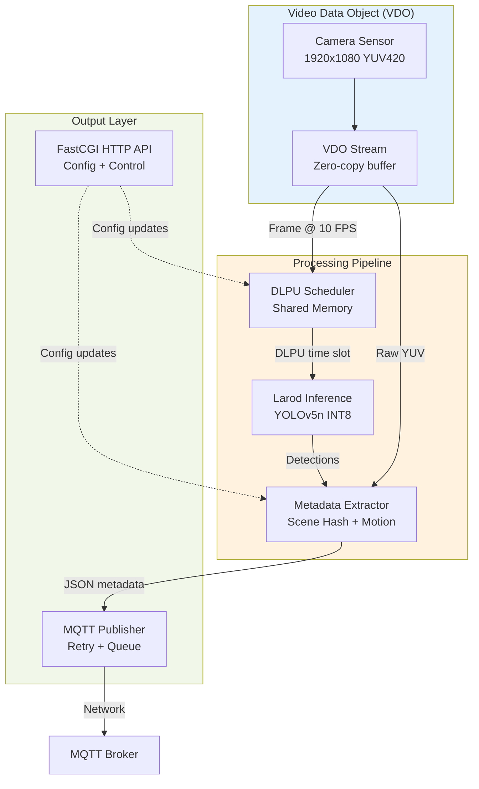
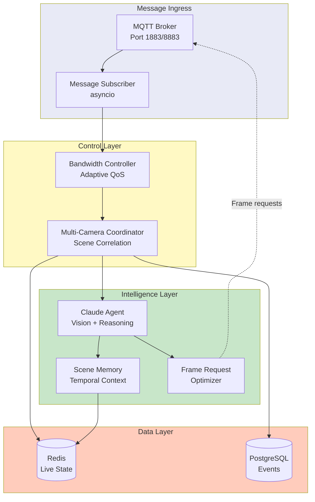
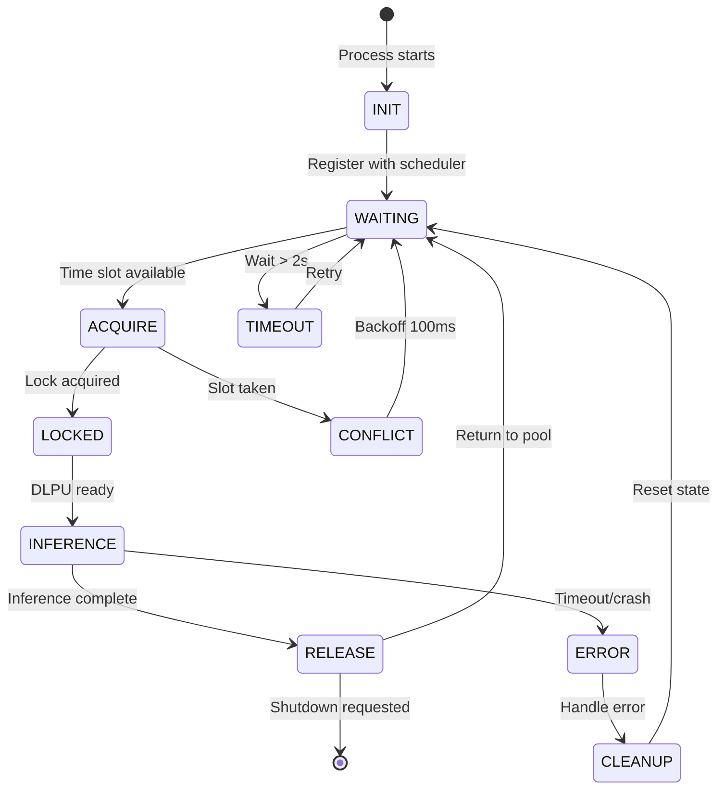
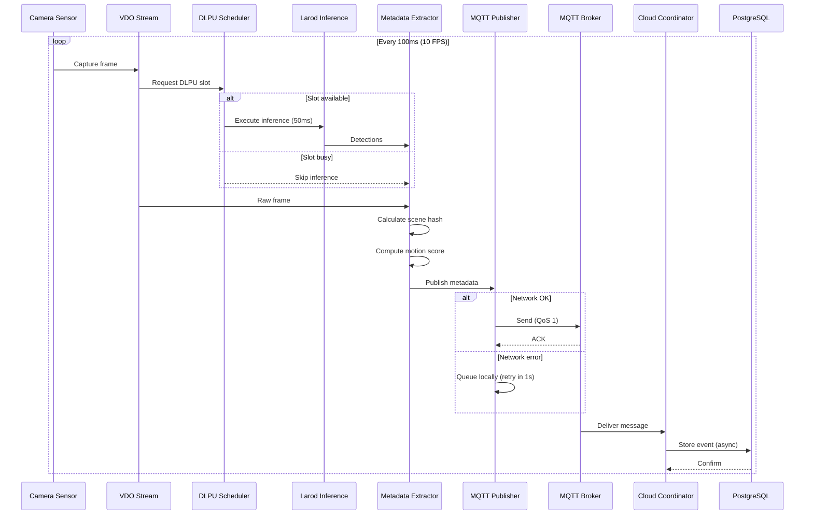

# Axis I.S. Platform Architecture Diagrams

**Version:** 1.0.0
**Date:** November 23, 2025
**Purpose:** Technical reference for distributed edge-cloud AI system

---

## 1. System Overview (High-Level)

### Diagram



### Description

**Architecture Pattern:** Edge-Cloud Distributed AI with MQTT-based streaming

**Key Components:**
- **Edge Layer:** 1-20 Axis cameras running ACAP applications, each performing local ML inference (YOLOv5n) and streaming lightweight metadata at 5-10 FPS
- **Network Boundary:** MQTT broker serves as message bus with QoS 1 reliability, supporting up to 200 msg/sec (20 cameras × 10 FPS)
- **Cloud Services:** Coordinator orchestrates multi-camera correlation, bandwidth management, and database operations
- **AI Services:** Claude API provides advanced vision analysis, scene understanding, and pattern detection on-demand

**Critical Paths:**
- Metadata streaming: Camera → MQTT → Bandwidth Controller → Coordinator (< 200ms latency target)
- Frame requests: Claude → Coordinator → Camera (< 2s round-trip for high-quality frame)

**Failure Points:**
- MQTT broker unavailability: Cameras queue messages locally (up to 1000 messages)
- Network congestion: Bandwidth controller reduces metadata FPS and frame quality
- Claude API rate limits: Request queuing with exponential backoff

**Network Protocols:**
- MQTT: TLS 1.3, QoS 1, keepalive 60s
- HTTP: FastCGI on cameras, REST API on coordinator
- WebSocket: Real-time dashboard updates (not shown)

---

## 2. Camera-Side Architecture

### Diagram



### Description

**Data Flow:** Sensor → VDO → DLPU Scheduler → Larod → Metadata Extraction → MQTT Publishing

**Key Interfaces:**
- **VDO API:** Zero-copy frame access using `vdo_stream_get_buffer()`, YUV420 native format, hardware timestamps for synchronization
- **DLPU Scheduler:** Shared memory coordination (`/dev/shm/dlpu_schedule`) with 200ms time slots per camera, supports up to 5 concurrent cameras
- **Larod API:** TFLite model execution on DLPU chip, 30-50ms inference time per frame (YOLOv5n INT8 quantized model)
- **MQTT Protocol:** QoS 1 with sequence numbering, exponential backoff retry (1s, 2s, 4s), persistent queue on SD card fallback

**DLPU Shared Memory Coordination:**
```c
struct dlpu_schedule {
    uint32_t camera_count;
    uint32_t slot_duration_ms;  // 200ms
    struct {
        pid_t pid;
        uint64_t last_access;
        uint8_t priority;       // 0-255
    } slots[5];
};
```

**Performance Targets:**
- VDO frame capture: < 5ms overhead
- DLPU inference: 30-50ms (YOLOv5n INT8)
- Metadata extraction: < 20ms
- MQTT publish: < 10ms (async)
- Total pipeline latency: < 100ms target, < 150ms max

**Resource Constraints:**
- Memory: 512MB allocated to ACAP, 280MB peak usage
- DLPU: 50ms inference × 10 FPS = 500ms compute per camera
- Network: 5-20 KB/message × 10 FPS = 50-200 KB/s per camera

---

## 3. Cloud-Side Architecture

### Diagram



### Description

**Architecture Pattern:** Event-driven microservices with centralized coordination

**Bandwidth Controller Logic:**
```python
def adjust_quality(network_stats):
    if packet_loss > 0.05:
        reduce_fps(target=5)          # From 10 FPS
        reduce_quality(target='MINIMAL')  # JPEG Q=60
    elif latency > 500ms:
        reduce_fps(target=7)
    elif network_healthy():
        restore_defaults()
```

**Coordinator Responsibilities:**
- **Multi-camera correlation:** Cross-reference object IDs across cameras using spatial proximity and appearance similarity
- **Time synchronization:** Align camera clocks using NTP + metadata timestamps, compensate for network jitter (±50ms tolerance)
- **Event aggregation:** Merge duplicate detections (same object seen by multiple cameras within 2s window)
- **Pattern detection:** Identify complex behaviors requiring multi-camera views (e.g., object tracking across zones)

**Redis State Structure:**
```json
{
  "camera:axis-camera-001": {
    "last_seen": 1732356000,
    "fps": 10,
    "quality": "HIGH",
    "scene_hash": "a3f2c9e1",
    "object_count": 3,
    "motion_score": 0.72
  },
  "scene:lobby": {
    "cameras": ["axis-camera-001", "axis-camera-002"],
    "active_objects": [{"id": "obj_123", "class": "person", "cameras": [1, 2]}],
    "last_activity": 1732356000
  }
}
```

**PostgreSQL Schema:**
- `events` table: Significant detections with full metadata (indexed by timestamp, camera_id, object_class)
- `frames` table: Frame request history with Claude analysis results
- `alerts` table: User-configured alert conditions (rules engine integration)

**Performance Requirements:**
- Message throughput: 200 msg/sec sustained (20 cameras × 10 FPS)
- Database writes: < 50 ms for event insertion (async batching)
- Redis operations: < 5 ms (in-memory state)
- Claude API latency: 2-5s per vision request (with caching)

---

## 4. DLPU Scheduler State Machine

### Diagram



### Description

**State Transitions:**

1. **INIT → WAITING:**
   - Process creates shared memory segment if first camera
   - Registers PID and priority in schedule table
   - Calculates assigned time slot: `camera_index × 200ms`

2. **WAITING → ACQUIRE:**
   - Check if current time modulo 1000ms matches assigned slot
   - Verify no other process holds DLPU lock
   - Transition only if both conditions true

3. **ACQUIRE → LOCKED:**
   - Atomic compare-and-swap (CAS) operation on lock field
   - Write PID and timestamp to shared memory
   - Set watchdog timer (200ms)

4. **LOCKED → INFERENCE:**
   - Load model tensors (5ms overhead, cached after first load)
   - Execute `larodRunInference()` (30-50ms)
   - Parse output tensors (< 5ms)

5. **INFERENCE → RELEASE:**
   - Clear DLPU lock atomically
   - Update last_access timestamp
   - Reset watchdog timer

**Conflict Resolution:**
- **Scenario:** Two cameras attempt to acquire same slot (clock skew or crash recovery)
- **Resolution:** CAS operation ensures only one succeeds, loser backs off 100ms and retries next cycle
- **Deadlock Prevention:** Watchdog timer forcibly releases lock after 200ms, marks slot as available

**Crash Recovery:**
- Watchdog detects stale locks (timestamp > 500ms old)
- Forcibly clears lock and resets slot
- Logs error for monitoring (potential hardware issue)

**Time Slot Allocation Example (5 cameras):**
```
Camera 1: 0ms, 1000ms, 2000ms, ...
Camera 2: 200ms, 1200ms, 2200ms, ...
Camera 3: 400ms, 1400ms, 2400ms, ...
Camera 4: 600ms, 1600ms, 2600ms, ...
Camera 5: 800ms, 1800ms, 2800ms, ...
```

**Scalability Limit:** 5 cameras maximum (5 × 50ms inference = 250ms compute per 1000ms cycle, 75% DLPU utilization)

---

## 5. Data Flow: Metadata Streaming

### Diagram



### Description

**Continuous Flow Characteristics:**
- **Frequency:** 10 FPS = 100ms interval per frame
- **Message Size:** 2-8 KB JSON (varies by object count)
- **Reliability:** QoS 1 ensures at-least-once delivery, sequence numbers detect duplicates

**Metadata Message Structure:**
```json
{
  "camera_id": "axis-camera-001",
  "timestamp": 1732356000.123,
  "sequence": 12345,
  "scene": {
    "hash": "a3f2c9e1",
    "motion_score": 0.72,
    "changed": false
  },
  "inference": {
    "executed": true,
    "duration_ms": 48,
    "objects": [
      {"class": "person", "confidence": 0.87, "bbox": [120, 80, 340, 520]},
      {"class": "car", "confidence": 0.92, "bbox": [600, 300, 900, 600]}
    ]
  },
  "bandwidth": {
    "quality": "HIGH",
    "network_mbps": 4.2
  }
}
```

**Retry/Reliability Mechanisms:**

1. **Network Failure Handling:**
   - Initial publish attempt with 5s timeout
   - On failure: Queue message to local ring buffer (max 1000 messages)
   - Retry with exponential backoff: 1s, 2s, 4s
   - Ultimate fallback: Write to SD card (`/var/spool/axis-is/pending/`)

2. **Sequence Number Tracking:**
   - Monotonic counter incremented per message
   - Cloud coordinator detects gaps: `expected_seq != received_seq`
   - Request retransmit via control channel (if gap < 100 messages)
   - Otherwise log data loss (likely extended network outage)

3. **Quality of Service:**
   - QoS 1 (at-least-once) prevents silent message loss
   - Broker persistence ensures messages survive broker restarts
   - Client clean session = false for connection resume

**Performance Monitoring:**
- Publish latency histogram (target: p99 < 50ms)
- Queue depth tracking (alert if > 100 messages)
- Retry rate (alert if > 5% messages require retry)
- Network bandwidth utilization (alert if > 80% of allocated)

---

## 6. Deployment Topology

### Diagram

```mermaid
graph TB
    subgraph Physical["Physical Network"]
        subgraph CameraNet["Camera Network (192.168.1.0/24)"]
            CAM1[Camera 1<br/>192.168.1.101]
            CAM2[Camera 2<br/>192.168.1.102]
            CAM3[Camera 3<br/>192.168.1.103]
        end

        subgraph EdgeGW["Edge Gateway"]
            SWITCH[PoE Switch<br/>24-port]
        end

        subgraph CloudHost["Cloud Server (192.168.1.50)"]
            direction TB
            DOCKER[Docker Host<br/>Ubuntu 22.04<br/>16 CPU / 64GB RAM]
        end
    end

    subgraph Containers["Docker Containers"]
        MOSQUITTO[mosquitto:2.0<br/>1GB RAM<br/>Port 1883/8883]
        REDIS_C[redis:7-alpine<br/>2GB RAM<br/>Port 6379]
        POSTGRES_C[postgres:16<br/>8GB RAM<br/>Port 5432]
        Axis I.S._COORD[axis-is-coordinator<br/>4GB RAM<br/>Python 3.11]
        GRAFANA[grafana/grafana<br/>1GB RAM<br/>Port 3000]
    end

    CAM1 --> SWITCH
    CAM2 --> SWITCH
    CAM3 --> SWITCH
    SWITCH --> DOCKER

    DOCKER --> MOSQUITTO
    DOCKER --> REDIS_C
    DOCKER --> POSTGRES_C
    DOCKER --> Axis I.S._COORD
    DOCKER --> GRAFANA

    Axis I.S._COORD --> MOSQUITTO
    Axis I.S._COORD --> REDIS_C
    Axis I.S._COORD --> POSTGRES_C

    style CameraNet fill:#e1f5ff
    style CloudHost fill:#f3e5f5
    style Containers fill:#fff9c4
```

### Description

**Docker Compose Stack:**

```yaml
version: '3.8'

services:
  mosquitto:
    image: eclipse-mosquitto:2.0
    ports:
      - "1883:1883"
      - "8883:8883"
    volumes:
      - ./mosquitto/config:/mosquitto/config
      - ./mosquitto/data:/mosquitto/data
    deploy:
      resources:
        limits:
          cpus: '2.0'
          memory: 1G
        reservations:
          cpus: '1.0'
          memory: 512M
    restart: unless-stopped

  redis:
    image: redis:7-alpine
    ports:
      - "6379:6379"
    volumes:
      - redis-data:/data
    deploy:
      resources:
        limits:
          cpus: '2.0'
          memory: 2G
    restart: unless-stopped

  postgres:
    image: postgres:16
    environment:
      POSTGRES_DB: axis-is
      POSTGRES_USER: axis-is
      POSTGRES_PASSWORD_FILE: /run/secrets/db_password
    ports:
      - "5432:5432"
    volumes:
      - postgres-data:/var/lib/postgresql/data
    deploy:
      resources:
        limits:
          cpus: '4.0'
          memory: 8G
    restart: unless-stopped

  coordinator:
    build: ./axis-is-coordinator
    environment:
      - MQTT_BROKER=mosquitto
      - REDIS_HOST=redis
      - POSTGRES_HOST=postgres
      - CLAUDE_API_KEY_FILE=/run/secrets/claude_api_key
    depends_on:
      - mosquitto
      - redis
      - postgres
    deploy:
      resources:
        limits:
          cpus: '8.0'
          memory: 4G
        reservations:
          cpus: '4.0'
          memory: 2G
    restart: unless-stopped

volumes:
  redis-data:
  postgres-data:
```

**Network Segments:**
- **Camera Network:** 192.168.1.0/24, PoE-powered, VLAN 10 (isolated for security)
- **Management Network:** 192.168.10.0/24, admin access only, VLAN 20
- **Internet Gateway:** NAT routing for Claude API access (outbound only)

**Resource Constraints:**

| Component | CPU | Memory | Storage | Network |
|-----------|-----|--------|---------|---------|
| Camera ACAP | 1 core | 512 MB | 100 MB | 200 KB/s |
| MQTT Broker | 2 cores | 1 GB | 10 GB | 5 MB/s |
| Redis | 2 cores | 2 GB | 5 GB | 1 MB/s |
| PostgreSQL | 4 cores | 8 GB | 500 GB | 2 MB/s |
| Coordinator | 4-8 cores | 4 GB | 50 GB | 5 MB/s |

**Scaling Considerations:**
- Single cloud server supports up to 20 cameras (200 msg/sec throughput)
- Beyond 20 cameras: Deploy additional coordinator instances with Redis cluster + PostgreSQL read replicas
- PoE switch power budget: 30W per camera × 20 = 600W (use 740W PoE switch minimum)

**Backup & Recovery:**
- PostgreSQL: Continuous WAL archiving + daily snapshots
- Redis: RDB snapshots every 15 minutes + AOF for durability
- Camera configs: Backed up to coordinator on change (restored via FastCGI API)

---

## Summary

This architecture delivers a production-ready distributed edge-cloud AI system with:

**Edge Intelligence:**
- Local ML inference (YOLOv5n) for real-time detection
- DLPU resource sharing via time-division multiplexing
- Bandwidth-efficient metadata streaming (2-8 KB/message)

**Cloud Orchestration:**
- Multi-camera scene correlation and pattern detection
- Adaptive bandwidth management for network resilience
- Claude API integration for advanced vision analysis

**Reliability Features:**
- QoS 1 messaging with retry logic and persistent queues
- Shared memory crash recovery with watchdog timers
- Container-based deployment with resource limits and health checks

**Performance Targets:**
- 10 FPS metadata streaming from up to 20 cameras
- < 200ms end-to-end latency for metadata delivery
- < 2s round-trip for on-demand frame requests
- 99.9% message delivery success rate

**Scalability:**
- Horizontal scaling via coordinator clustering (20+ cameras)
- Vertical scaling via DLPU time slot optimization
- Cloud-native architecture supporting multi-tenant deployments

---

**Document Version:** 1.0.0
**Last Updated:** November 23, 2025
**Maintained By:** Axis I.S. Architecture Team
